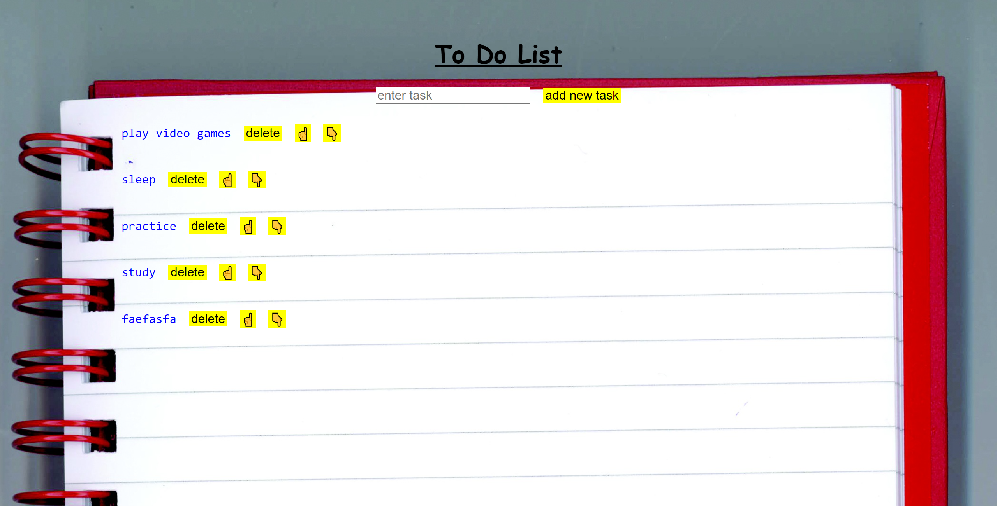
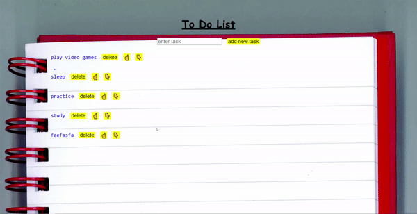

# Todo List

## Date: 10/6/2024

### By: Hussain Al Aradi

#### [Gmail](hussainAlAradi.ha@gmail.com) | [GitHub](https://github.com/HussainALAradi5) | [LinkedIn](https://www.linkedin.com/in/hussainalaradi/)

---

### **_Description_**

#### this project is just small frontEnd project to improve my skills in the frontEnd and espically React library 

---

### **_Technologies Used_**

- JS( as its the languge that i use here)
-React(library )
-CSS
-HTML

---

### **_Getting Started_**

##### just play the game and enjoy it

---

### **_Screenshots_**

##### image header 1

##### image header 2

## 

### **_Future Updates_**

- [x] add task
- [x] remove task
- [x] Re-allocate tasks
- [] enhancing the visuals
---

### **_Credits_**

##### my instructors (for give me the idea  to improve my skills)

##### 

##### google for photos

---
